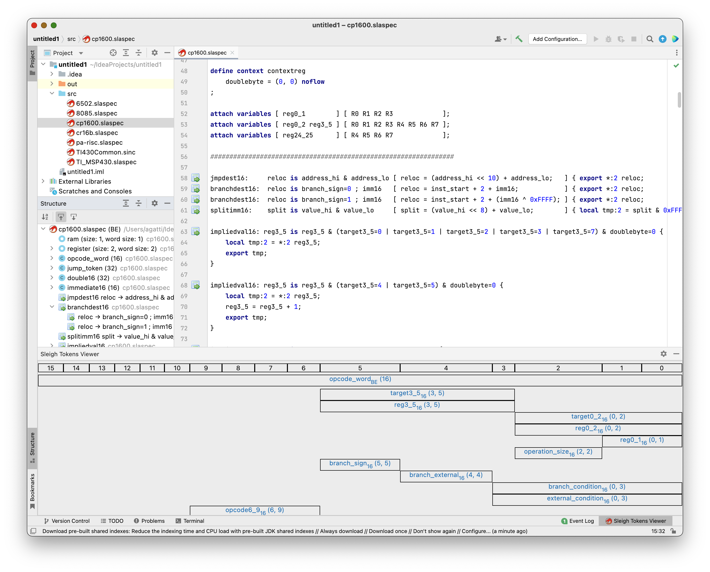

# SleighIDEA

[Ghidra](https://ghidra-sre.org/) provides a Sleigh plugin for Eclipse, but if you prefer IntelliJ for working on
Ghidra, just like the author, there is nothing helping you out. This is an attempt to fill this gap by creating
a [Sleigh](https://ghidra.re/courses/languages/html/sleigh.html) plugin for IntelliJ.

## What is there

* File type recognition
* Mostly working implementation of a Sleigh grammar
* Some token colouring in the editor view
* Simple colour customisation support
* Gutter icons for tables and opcodes
* Basic structure view support for opcodes
* Basic folding support.

## What is not there

Pretty much everything else:

* 100% compatibility with Sleigh's compiler
* `@include`, `@ifdef`, `@define`, `@endif`
* Full folding support
* Full structure view
* Full syntax colouring
* Autocompletion support
* Handling of `.ldefs`, `.cspec`, `.pspec`, and `.opinion` files
* Syntax inspections
* etc.

## FAQ

### Why is this not yet 100% compatible with Ghidra's Sleigh compiler?

Ghidra's grammar is based upon ANTLR v3 and as such there is no easy way I know of to lift the grammar files directly
and use them in the plugin as they are. There is a library that claims to handle ANTLR v4 grammars and make PSI elements
out of them, but alas this cannot be the case.

For this I had to convert Ghidra's ANTLR v3 grammar into
JetBrains' [Grammar-Kit](https://github.com/JetBrains/Grammar-Kit) PEG-based format, and I have probably introduced bugs
in parsing or there are some original constructs that cannot be mapped 1:1 from ANTLR v3 to PEG.

### How do I build this?

* Install the [Grammar-Kit plugin](https://plugins.jetbrains.com/plugin/6606-grammar-kit/), then restart the IDE if
  requested.
* Import the project
* Find `SleighGrammar.bnf`, right click on it and select **Generate Parser Code**, it should ask you to save a file
  called `_SleighLexer.flex` in the same directory as the .bnf file - do not change the file name and let it proceed
* Right click on the `_SleighLexer.flex` file you just generated and select **Run JFlex Generator**.

### Can't you just generate the parser and lexer files when building?

The Grammar-Kit plugin for Gradle fails to generate a parser for the project as it triggers the same error
as https://github.com/JetBrains/gradle-grammar-kit-plugin/issues/48. Now, the workaround
at https://github.com/JetBrains/ForTea/commit/3edee0f78b15c1bb5d903cc0898f08c80c5b4552 solves that particular problem,
but for some other reason grammar elements' accessor methods are not generated. The class mentioned in the
grammar's `psiImplUtilClass` configuration key is found correctly from the IntelliJ plugin but not from Gradle, no real
idea why.

### How do I run this?

Right now the plugin is simply not complete enough to be put on the JetBrains plugin market, so for now unless you plan
to test this or work on it, just hold on until things are ready. That said, once you can successfully build the plugin
using the instructions in the appropriate section, executing the `runIde` Gradle task from the Gradle tasks list should
do the trick.

### Screenshot?

## Licences and copyright

* All non-generated code is licensed under the Apache 2.0 licence.

* The filetype icon is taken from Ghidra's source code repository and it is believed to be released under the same
  licence as Ghidra, hence Apache 2.0.
* The table and opcode marker icons are taken from [FamFamFam](http://www.famfamfam.com/lab/icons/silk/), and licensed
  under the Creative Commons Attributed 2.5 licence.

A copy of the Apache 2.0 licence is available in the repository as `LICENCE.txt`.

Where it applies: Copyright 2021 Alessandro Gatti - frob.it